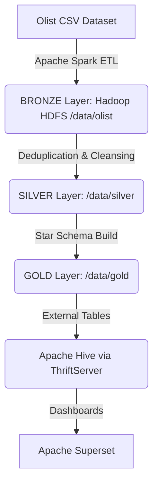

# Büyük Veri Analitik Pipeline: Faz 2 - Veri Ambarı Tasarımı ve İş Analitiği 🚀


> **Geliştirici:** Ahmet Berat Yıldırımlı

## 📖 Proje Özeti

Faz 1'de, Olist e-ticaret veri setini 9 ham CSV dosyasından alıp Apache Spark ile Parquet formatına çeviren, Hadoop HDFS'te depolayan, Apache Hive external table'ları üzerinden SQL ile sorgulanabilir hale getiren ve Apache Superset'te görselleştiren uçtan uca bir pipeline kurulmuştu. 

**Faz 2**, bu mimariyi bir adım öteye taşıyarak şu geliştirmeleri içermektedir:
*   **Veri Kalite Ölçümü:** 9 ham tablonun tamamında null ve duplicate kontrolleri gerçekleştirildi.
*   **Veri Temizliği (Silver Katmanı):** Tespit edilen sorunlu tablolar (`geolocation` ve `reviews`) deduplicate edilerek temizlendi.
*   **Katmanlı Mimari (Medallion):** Tek katmanlı yapıdan **Bronze / Silver / Gold** olmak üzere 3 katmanlı modern veri ambarı mimarisine geçildi.
*   **Star Schema (Gold Katmanı):** 7 temel iş sorusunu (business question) cevaplamak üzere **4 Fact** ve **5 Dimension** tablosundan oluşan boyutsal model tasarlandı ve Spark ile inşa edildi.
*   **ETL'den ELT'ye Geçiş:** Hive'da yüklü ham veriler üzerinden SQL/Spark dönüşümleriyle Star Schema oluşturuldu.
*   **Otomasyon Scriptleri:** Süreçleri otomatize eden `data_quality_check.py`, `build_star_schema.py` ve `register_gold_tables.py` scriptleri eklendi.

## 🛠️ Kullanılan Teknolojiler

*   **İşleme Motoru (ETL/ELT):** Apache Spark (PySpark)
*   **Dağıtık Depolama:** Hadoop HDFS
*   **SQL Sorgu Katmanı:** Apache Hive (Spark ThriftServer üzerinden)
*   **Veri Görselleştirme:** Apache Superset
*   **Konteynerizasyon:** Docker & Docker Compose
*   **Veri Formatı:** Apache Parquet

## 🏗️ Mimari (Bronze - Silver - Gold)

Proje, her katmanın tek bir görevi olduğu ve sorgu zamanında yalnızca bir önceki katmanı okuduğu üç katmanlı bir mimari izler. Superset yalnızca Gold katmanını sorgulayarak yüksek performans sağlar.



## 📊 Veri Modeli (Star Schema)

Gold katmanında yer alan veri modeli aşağıdaki tablolardan oluşmaktadır:

**Fact Tabloları:**
1.  `fact_order_items`
2.  `fact_payments`
3.  `fact_delivery`
4.  `fact_reviews`

**Dimension Tabloları:**
1.  `dim_date`
2.  `dim_customer`
3.  `dim_seller`
4.  `dim_product`
5.  `dim_payment_type`


## 📈 İş Soruları ve Superset Dashboard

Aşağıdaki 7 temel iş sorusu doğrudan Gold katmanındaki veri modeli kullanılarak cevaplanmıştır:

| İş Sorusu (Business Question) | Fact Tablosu | Dimension Tabloları |
| :--- | :--- | :--- |
| **Aylık ciro analizi** | `fact_order_items` | `dim_date` |
| **Kategori bazlı gelirler** | `fact_order_items` | `dim_product` |
| **En yüksek performanslı satıcılar** | `fact_order_items` | `dim_seller` |
| **Eyalet bazlı satış dağılımı** | `fact_order_items` | `dim_customer` |
| **Eyalet bazlı ortalama teslimat süresi** | `fact_delivery` | `dim_customer`, `dim_date` |
| **Ödeme yöntemi trendleri** | `fact_payments` | `dim_payment_type`, `dim_date` |
| **Kategori bazlı ortalama inceleme puanı** | `fact_reviews` | `dim_product`, `dim_date` |

### Dashboard Çıktılarından Özetler:
*   **Gelir Trendleri:** 2017 boyunca hızlı bir büyüme yaşanmış, 2018 itibariyle sabitlenmiştir.
*   **Coğrafi Satışlar:** São Paulo (SP) eyaleti toplam ciroda açık ara liderdir.
*   **Ödeme Yöntemleri:** Kredi kartı kullanımı baskın ve en hızlı büyüyen yöntemdir.
*   **Teslimat Süreleri:** Eyaletlere göre farklılık göstererek ~9 gün (SP) ile ~29 gün (Roraima) arasında değişmektedir.
*   **Müşteri Memnuniyeti:** Puan ve yorum hacmini aynı anda göstermek için "Bubble Chart" tercih edilmiş, istatistiksel güvenilirlik için 20'den az yoruma sahip kategoriler filtrelenmiştir.
## 🚀 Running the Project phase 1

Clone the repository:

```bash
git clone https://github.com/berat-yildirimli/BigData-Pipeline-Project.git
```
Create the shared network: scripts/setup_network.ps1 (Windows) or scripts/setup_network.sh

Start the required services:
```bash
docker compose -f docker/docker-compose-hdfs.yml up -d

docker compose -f docker/docker-compose-spark.yml up -d

docker compose -f docker/docker-compose-superset.yml up -d
```

Download manually the Olist dataset from Kaggle and extract the CSVs into processing/data/
or use:
```bash	
python scripts/download_dataset.py
```


Run the ETL pipeline to convert the CSVs to Parquet and write them to HDFS:
```bash
docker exec -it spark-master /spark/bin/spark-submit \
  --master spark://spark-master:7077 \
  /app/processing/analysis.py
```

 
Copy and run `register_tables.py` inside the Superset container (table and dataset registration):
```bash
docker cp visualization/register_tables.py superset:/tmp/register_tables.py
docker exec -it superset python /tmp/register_tables.py
```

Open:

| Service | URL |
| :---: | :---: |
| HDFS NameNode | http://localhost:9870 |
| Spark Master | http://localhost:8080 |
| Apache Superset | http://localhost:8088 |

Default Superset credentials:

```text
Username: admin
Password: admin
```

## 🚀 Çalıştırma Adımları ve Otomasyon phase 2

### 1. Veri Kalite Kontrolü
Bronze tablolarında null ve duplicate taraması yapılır.
```bash
docker exec -it spark-master /spark/bin/spark-submit   --master spark://spark-master:7077   /app/processing/data_quality_check.py
```

### 2. Silver ve Gold Katmanlarının İnşası
Sorunlu tablolar temizlenir (Silver) ve Parquet formatında Star Schema (Gold) oluşturulur.
```bash
docker exec -it spark-master /spark/bin/spark-submit   --master spark://spark-master:7077   /app/processing/build_star_schema.py
```

### 3. Gold Tablolarının Hive ve Superset'e Kaydedilmesi
Oluşturulan tablolar Hive'a external table olarak eklenir ve Superset'e kaydedilir.
```bash
docker cp visualization/register_gold_tables.py superset:/tmp/register_gold_tables.py
docker exec -it superset python /tmp/register_gold_tables.py
```

