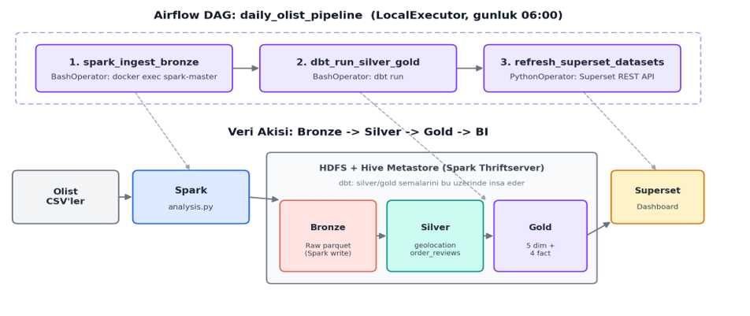

# Büyük Veri Analitik Pipeline: Faz 1-3 — Otomatik Veri Ambarı ve Orkestrasyon 🚀


> **Geliştirici:** Ahmet Berat Yıldırımlı

## 📖 Proje Özeti

Faz 1'de, Olist e-ticaret veri setini 9 ham CSV dosyasından alıp Apache Spark ile Parquet formatına çeviren, Hadoop HDFS'te depolayan, Apache Hive external table'ları üzerinden SQL ile sorgulanabilir hale getiren ve Apache Superset'te görselleştiren uçtan uca bir pipeline kurulmuştu.

**Faz 2**, bu mimariyi bir adım öteye taşıyarak şu geliştirmeleri içermektedir:
*   **Veri Kalite Ölçümü:** 9 ham tablonun tamamında null ve duplicate kontrolleri gerçekleştirildi.
*   **Veri Temizliği (Silver Katmanı):** Tespit edilen sorunlu tablolar (`geolocation` ve `reviews`) deduplicate edilerek temizlendi.
*   **Katmanlı Mimari (Medallion):** Tek katmanlı yapıdan **Bronze / Silver / Gold** olmak üzere 3 katmanlı modern veri ambarı mimarisine geçildi.
*   **Star Schema (Gold Katmanı):** 7 temel iş sorusunu (business question) cevaplamak üzere **4 Fact** ve **5 Dimension** tablosundan oluşan boyutsal model tasarlandı ve Spark ile inşa edildi.
*   **ETL'den ELT'ye Geçiş:** Hive'da yüklü ham veriler üzerinden SQL/Spark dönüşümleriyle Star Schema oluşturuldu.
*   **Otomasyon Scriptleri:** Süreçleri otomatize eden `data_quality_check.py`, `build_star_schema.py` ve `register_gold_tables.py` scriptleri eklendi.

**Faz 3**, elle çalıştırılan bu süreci uçtan uca otomatikleştirdi:
*   **Orkestrasyon (Apache Airflow):** `daily_olist_pipeline` DAG'ı, Bronze yüklemesinden Superset senkronizasyonuna kadar tüm zinciri zamanlanmış/tetiklenebilir tek bir iş akışında birleştirir.
*   **dbt (Data Build Tool):** Silver ve Gold katmanlarını inşa eden PySpark script'i (`build_star_schema.py`), 11 modüler, test edilebilir SQL modeline (`dbt_project/models/`) taşındı.
*   **Otomatik Testler:** Her surrogate key için `unique`/`not_null` testleri deklaratif olarak tanımlandı (`schema.yml`) — Faz 2'de hiç otomatik test yoktu.
*   **Mimari Kararlar:** Ödevin önerdiği Apache Doris ve MinIO yerine, mevcut Hive/Spark Thriftserver ve HDFS altyapısı korunarak dbt'nin hedefi yapıldı (gerekçe için `reports/` klasöründeki Faz 3 raporuna bakınız).

## 🛠️ Kullanılan Teknolojiler

*   **Orkestrasyon:** Apache Airflow 3.3.0 (LocalExecutor)
*   **Dönüşüm Katmanı (Silver/Gold):** dbt (dbt-core + dbt-spark[pyhive])
*   **İşleme Motoru (Bronze ETL):** Apache Spark (PySpark)
*   **Dağıtık Depolama:** Hadoop HDFS
*   **SQL Sorgu Katmanı:** Apache Hive (Spark ThriftServer üzerinden)
*   **Veri Görselleştirme:** Apache Superset
*   **Konteynerizasyon:** Docker & Docker Compose
*   **Veri Formatı:** Apache Parquet

## 🏗️ Mimari (Airflow ile Orkestre Edilen Bronze - Silver - Gold)

`daily_olist_pipeline` DAG'ı üç görevi sırayla tetikler: Bronze'un Spark ile yeniden yüklenmesi, Silver/Gold'un dbt ile yeniden inşa edilmesi, ve Superset dataset'lerinin senkronize edilmesi.




## 🚀 Running the Project phase 1

Clone the repository:

```bash
git clone https://github.com/berat-yildirimli/BigData-Pipeline-Project.git
```
Create the shared network: scripts/setup_network.ps1 (Windows) or scripts/setup_network.sh

Start the required services:
```bash
docker compose -f docker/docker-compose-hdfs.yml up -d

docker compose -f docker/docker-compose-spark.yml up -d

docker compose -f docker/docker-compose-superset.yml up -d
```

Download manually the Olist dataset from Kaggle and extract the CSVs into processing/data/
or use:
```bash 
python scripts/download_dataset.py
```


Run the ETL pipeline to convert the CSVs to Parquet and write them to HDFS:
```bash
docker exec -it spark-master /spark/bin/spark-submit \
  --master spark://spark-master:7077 \
  /app/processing/analysis.py
```

 
Copy and run `register_tables.py` inside the Superset container (table and dataset registration):
```bash
docker cp visualization/register_tables.py superset:/tmp/register_tables.py
docker exec -it superset python /tmp/register_tables.py
```

Open:

| Service | URL |
| :---: | :---: |
| HDFS NameNode | http://localhost:9870 |
| Spark Master | http://localhost:8080 |
| Apache Superset | http://localhost:8088 |

Default Superset credentials:

```text
Username: admin
Password: admin
```

## 🚀 Çalıştırma Adımları ve Otomasyon phase 2

### 1. Veri Kalite Kontrolü
Bronze tablolarında null ve duplicate taraması yapılır.
```bash
docker exec -it spark-master /spark/bin/spark-submit   --master spark://spark-master:7077   /app/processing/data_quality_check.py
```

### 2. Silver ve Gold Katmanlarının İnşası
Sorunlu tablolar temizlenir (Silver) ve Parquet formatında Star Schema (Gold) oluşturulur.
```bash
docker exec -it spark-master /spark/bin/spark-submit   --master spark://spark-master:7077   /app/processing/build_star_schema.py
```

### 3. Gold Tablolarının Hive ve Superset'e Kaydedilmesi
Oluşturulan tablolar Hive'a external table olarak eklenir ve Superset'e kaydedilir.
```bash
docker cp visualization/register_gold_tables.py superset:/tmp/register_gold_tables.py
docker exec -it superset python /tmp/register_gold_tables.py
```

> **Not (Faz 3):** Bu üç adım artık elle çalıştırılmıyor — aşağıdaki Airflow DAG'ı tarafından otomatik olarak tetikleniyor. `register_gold_tables.py`'nin Hive tablo oluşturma kısmı da dbt tarafından devralındığı için artık aktif kullanılmıyor, sadece tarihsel referans olarak repoda duruyor.

## 🚀 Çalıştırma Adımları ve Otomasyon phase 3

### 1. Airflow'u ayağa kaldır
`docker/` klasörünün içinden:
```bash
docker compose -f docker-compose-airflow.yml build
docker compose -f docker-compose-airflow.yml up airflow-init
docker compose -f docker-compose-airflow.yml up -d
```

### 2. dbt bağlantısını doğrula (opsiyonel)
```bash
docker exec -it airflow-airflow-scheduler-1 dbt debug --project-dir /opt/airflow/dbt_project
```

### 3. DAG'ı tetikle
`http://localhost:8090` adresinden Airflow arayüzüne gir (kullanıcı adı/şifre: `airflow` / `airflow`), `daily_olist_pipeline` DAG'ını aktif et ve **Trigger DAG** ile manuel çalıştır — ya da günlük 06:00 zamanlamasını bekle.

DAG sırasıyla şunları yapar:
1.  **spark_ingest_bronze** — Bronze katmanını Spark ile yeniden yükler
2.  **dbt_run_silver_gold** — Silver ve Gold katmanlarını dbt ile yeniden inşa eder
3.  **refresh_superset_datasets** — Superset dataset'lerini güncel `gold` şemasıyla senkronize eder

Manuel/CLI üzerinden çalıştırmak istersen (Airflow UI olmadan):
```bash
docker exec -it airflow-airflow-scheduler-1 bash -c "cd /opt/airflow/dbt_project && dbt run"
docker exec -it airflow-airflow-scheduler-1 bash -c "cd /opt/airflow/dbt_project && dbt test"
```

Open:

| Service | URL |
| :---: | :---: |
| HDFS NameNode | http://localhost:9870 |
| Spark Master | http://localhost:8080 |
| Apache Superset | http://localhost:8088 |
| Apache Airflow | http://localhost:8090 |

Default Airflow credentials:

```text
Username: airflow
Password: airflow
```

## 📄 Raporlar

*   `reports/` — Faz 3 raporu (mimari kararlar, DAG walk-through, karşılaşılan zorluklar ve çözümleri, sonuç doğrulamaları)